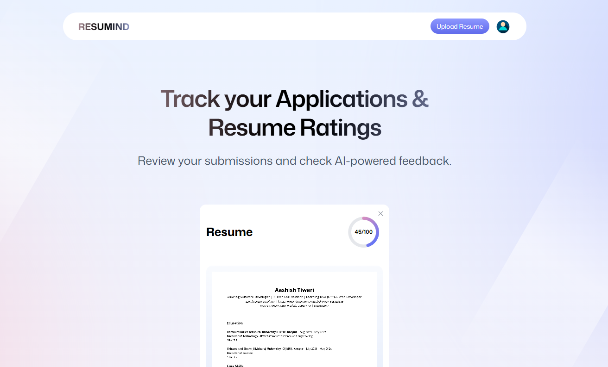
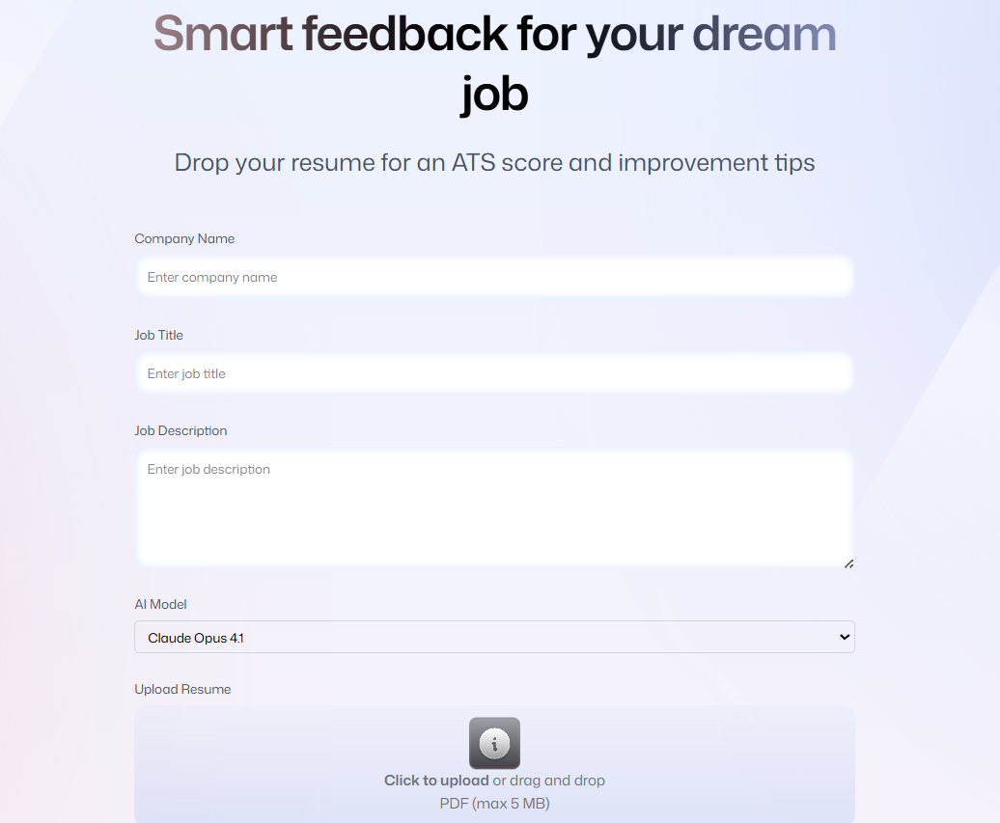
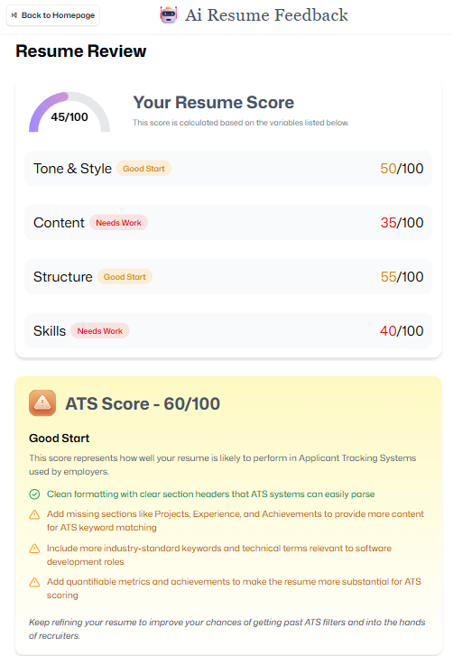

# 🤖 AI Resume Analyzer

An AI-powered web application that analyzes resumes and provides intelligent feedback to help users improve their chances of passing Applicant Tracking Systems (ATS) and getting shortlisted for jobs.

The application allows users to upload resumes, receive AI-generated analysis, view an ATS score, and download feedback reports.

[](https://ai-resume-analyzer-three-taupe.vercel.app/)

---

## 🚀 Features

* 📄 **Resume Upload** – Upload resume files directly through the web interface
* 🤖 **AI Resume Analysis** – AI evaluates resume content, structure, and skills
* 📊 **ATS Score Generation** – Shows how well the resume performs with ATS systems
* 💡 **Detailed Feedback** – Suggestions for improving resume quality
* 🔐 **User Authentication** – Login and session management using Puter.js
* ☁️ **Cloud Storage** – Resume files stored securely with Puter.js
* 👤 **User Profile** – Profile section with logout functionality

---

## 🛠 Tech Stack

**Frontend**

* React
* TypeScript
* Tailwind CSS
* React Router

**State Management**

* Zustand

**Services**

* Puter.js (Authentication, Storage, AI)

**Tools**

* Vite
* Git & GitHub

---

## 📂 Project Structure

```
AI-Resume-Analyzer
│
├── app
│   ├── components
│   ├── routes
│   ├── constants
│   ├── types
│   └── root.tsx
│
├── public
├── package.json
├── tsconfig.json
├── vite.config.ts
└── README.md
```

---

## ⚙️ Installation & Setup

### Clone the Repository

```
git clone https://github.com/Ashish-Tiwari80/AI-Resume-Analyzer.git
```

### Navigate to the Project Folder

```
cd AI-Resume-Analyzer
```

### Install Dependencies

```
npm install
```

### Start Development Server

```
npm run dev
```

The application will run on:

```
http://localhost:5173
```

---

## 📸 Screenshots

### Home Page


### Resume Upload


### AI Resume Analysis



---

## 🎯 Use Cases

* Students preparing resumes for internships
* Job seekers optimizing resumes for ATS systems
* Developers learning AI-powered web applications

---

## 🔮 Future Improvements

* Resume comparison with job descriptions
* Keyword optimization suggestions
* Resume history tracking
* Advanced analytics dashboard

---

## 👨‍💻 Author

Ashish Tiwari

GitHub:
https://github.com/Ashish-Tiwari80

---

## 📜 License

This project is open-source and available under the MIT License.
